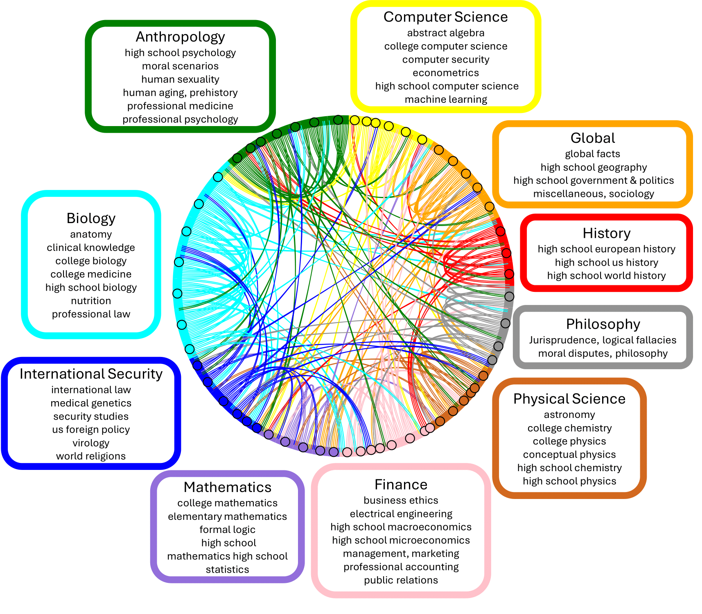
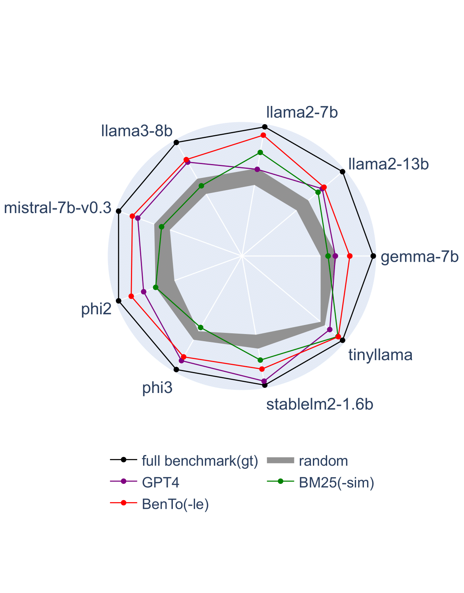

# Benchmark Reduction with In-Context Transferability
This is the Github repo for Our paper 'Benchmark Reduction with In-Context Transferability'.

Evaluating large language models (LLMs) is costly: it requires generation and examination on a large benchmark of various tasks. 
This paper investigates how to efficiently reduce the tasks benchmarking LLMs without affecting the evaluation results. 
Our study reveals that task transferability and relevance provide critical information to identify the most representative subset of tasks via optimizing a facility location function.
We propose a practically efficient metric for estimating the transferability between two tasks via in-context learning (ICL). 
By analyzing the pairwise transferability, we can reduce tasks in a modern LLM benchmark (e.g., MMLU or FLAN) to 5\% while inducing only a $<4$\% difference to the evaluation on the original benchmark. 
Compared to prior works, our method is training-free and gradient-free. It solely relies on ICL and achieves significant advantages in efficiency. 




| Model            | MMLU(100%) | MMLU<sub>BenTo</sub> | Relative Error   | BBH(100%) | BBH<sub>BenTo</sub> | Relative Error   |
|------------------|-------------------|------------------------|------|-------------------|------------------------|------|
| Llama-2-13b      | 54.5 (54.8)*       | 53.9                  | 0.01 | 45.3 (39.4)       | 49.6                   | 0.09 |
| Llama-2-7b       | 46.0 (45.3)       | 49.8                  | 0.08 | 37.1 (32.6)       | 35.4                   | 0.05 |
| Llama-3-8b       | 61.7 (69.4)       | 60.2                  | 0.02 | 59.1 (61.1)       | 57.6                   | 0.03 |
| Mistral-7b-v0.3  | 62.1 (61.1)       | 62.2                  | 0.00 | 56.3 (56.0)       | 56.0                   | 0.01 |
| Phi-2            | 56.5 (56.7)       | 56.7                  | 0.00 | 58.6 (59.2)       | 56.7                   | 0.03 |
| Phi-3-mini-4k    | 69.5 (70.9)       | 70.0                  | 0.01 | 70.2 (73.5)       | 64.2                   | 0.09 |
| StableLM-2-1.6B  | 34.6 (-)          | 34.7                  | 0.00 | 23.4 (-)          | 20.7                   | 0.12 |
| TinyLlama        | 24.9 (26.6)       | 25.9                  | 0.04 | 25.1 (29.3)       | 25.1                   | 0.00 |
| Gemma-7b         | 65.2 (64.3)       | 63.4                  | 0.03 | -**                 | -                      | -    |

*The numbers in parentheses indicate values reported by previous works.

**Gemma-7b doesn't output answers in the correct format in our experiments.

## Usage
You can install the environments with 
```
conda env create -f environment.yml
```

## Datasets
You can download the datasets at [huggingface](https://huggingface.co/datasets/cindermond/bento). 
We also support directly load datasets from huggingface by adding '--use_remote_data' flag in the inference script. In that case, '--data_folder' should be a cache directory to save the downloaded data.

## Inference
We provide an [example inference script](inference.sh).

Explanation of arguments: 

'--task', available options are 'mmlu', 'flan', 'bbh' and 'agieval'.

'--data_folder', the path of the local data folder, or the cache dir for data if '--use_remote_data' is set.

'--cache_dir', the cache dir for the model and tokenizer.

'--use_remote_data', if directly load data from huggingface.

'--is_reduced', if evaluate on the reduced dataset.

'--example_num', number of examplars for ICL. Useless when task='bbh'.

'--eval_times', times of evaluation for each test sample, each time the examplars are randomly sampled/ordered. The final result is the average of all evaluations. Useless when task='bbh'.

'--output_filename', a json file that will be produced in the evaluation, containing all the responses. Useless when task=flan.

'--model', name of the model.

If you need to use gated Huggingface models, set the environmental variable 'HF_TOKEN' to your personal Huggingface token before running the script.

## License
This repo and the dataset is under Apache 2.0 license. The dataset is based on [MMLU](https://arxiv.org/abs/2009.03300), [FLAN](https://arxiv.org/abs/2109.01652), [Big Bench Hard](https://arxiv.org/abs/2210.09261) and [AgiEval English](https://arxiv.org/abs/2304.06364).

The non-"reduced" benchmark on huggingface is the original benchmark, except for FLAN, which is a sampled version. 
The "reduced" benchmark only contains a few representative tasks in the original ones, such that the performance on the "reduced" benchmark can serve as an approximation to the performance on the original ones.

### Citation
Please consider cite our paper if you find this work useful.

```
@article{zhao2024bento,
  title={Benchmark Reduction with In-Context Transferability},
  author={Hongyu Zhao and Ming Li and Lichao Sun and Tianyi Zhou},
  journal={arXiv preprint},
  year={2024}
}
```
